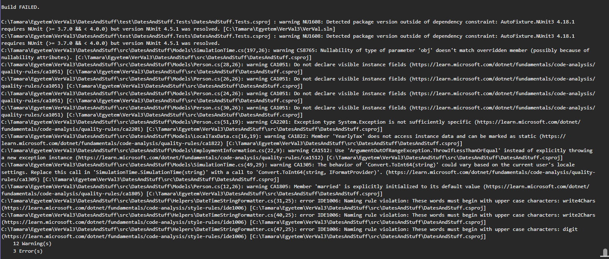
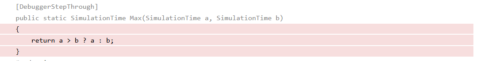
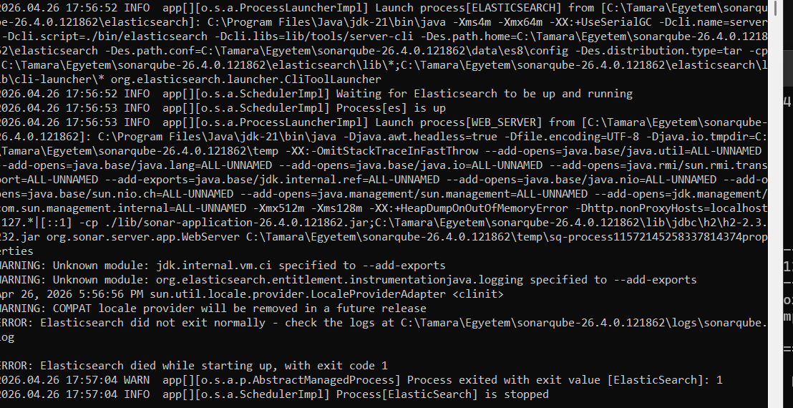

# VerVal 3 Labor

Megoldandó feladatok:

Ebben a feladatban a standard kódminőségi munkafolyamatok pár eszközét próbáljuk ki.

1. (1 pont) Adjon egy `.editorconfig` fájlt a solution-höz. A fájl tartalmazza a formázási szabályokat, de ne futtasson automatikus kódjavítást (cleanup) a meglévő kódon.

2. (2 pont) Nézzen utána az interneten, hogyan kell beállítani, hogy az ilyen hibák ne csak warningok, messages legyenek, hanem build hiba erősségű figyelmeztetések. A naming rule violationok legyenek error hiba erősségűek.  -> Ha minden jól megy, most a lokális build el kell essen. - A readme-hez adjon egy screenshotot az eleső buildről (dotnet build futtatása). A screenshotot ehhez az alponthoz tegye.
[
3. (3 pont) Hozzon létre egy **GitHub Actions** workflow-t (munkafolyamat), amely minden feltöltéskor (push) automatikusan elvégzi a `dotnet restore` és `dotnet build` lépéseket. A futásnak látszódnia kell az Actions menüpont alatt. Ezt fogjuk nézni házi ellenőrzésnél.

4. (4 pont) Egészítse ki a workflow-t automatizált tesztfuttatással és **code coverage** (lefedettség) generálással. A folyamat készítsen HTML riportot, és ezt mentse el **artifact**-ként a futás végén.

5. (2 pont) Nézze végig a coverage riportot és keressen olyan kódot, amit nem fed le teszt. Erről készítsen egy screenshot-t és illesze ide a readme-be. Írjon tesztet, ami lefedi a kérdéses kódot. Commitolja az új teszet, majd az új reportból bizonyítsa, hogy ez sikeres volt (az összesítő oldalon javulnak a lefedettségi számok, az előzőleg megcélzott kód már lefedésre került).
[
A következő feladathoz fog kelleni egy JS/TS projekt. Lehet használni más tantárgynál lévő projektet pl. webből, viszont ha valaki ezzel nem szeretne élni, itt egy egyszerű JavaScript projekt (https://github.com/ubb-verval-2026/ubb-verval-simple-js-project), amit `npx serve` paranccsal lehet futtatni. A választott projektet húzza be ebbe a labor repo-jába.

6. (2 pont) Konfiguráljon a technológiának megfelelő kódformázási standardokat a kérdéses kódokra. (pl. eslint, prettier ..stb)

7. Bónusz (2 pont) A JS kódok formázását kikényszerítheti husky git hookok használatával, ahogy azt pl. itt is látja: https://github.com/actions/setup-dotnet/tree/main/.husky  Doksi:https://typicode.github.io/husky/ . Írjon egy szándékosan hanyagabb kódot, és mutassa be, hogy push után a hook automatikusan kijavította azt. (a példa js projekt minimálisan az :)).

8. (3 pont) Ezt a kódkupacot kösse be SonarCube alá. Ideális esetben a community buildet használja innen (https://www.sonarsource.com/products/sonarqube/downloads/). Ha a StartSonar paranccsal nem indulna valamiért el a Sonar, ne küzdjünk a megjavítással, használjuk a Sonar Cloud ingyenes megoldását az analízisre (egy screenshot a SonarCube indulási hibájáról kell ebben az esetben ide a readme-be). - A readme-ben mutassa meg az össesítő oldalát a kódoknak, amiket bekötött a Sonar alá.
[

9. (3 pont) Elemezze a Sonar által talált hibákat. Válassza ki a legfontosabbnak ítélt problémát, javítsa ki, majd az újabb analízissel igazolja a javulást a dokumentációban. Egy screenshot-t ide a readme-be a hibáról a Sonar oldalán.
